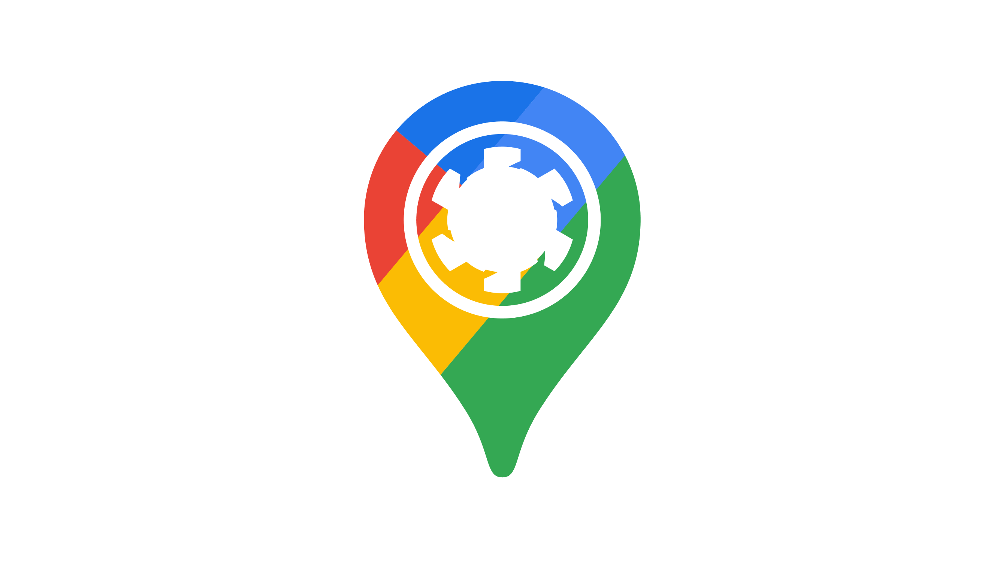

# Quasar Google Maps 🗺️



Olá, seja bem-vindo ao projeto. Nesse repositório você encontrará exemplos de Serviços disponíveis no SDK do Google Maps para javascript.

Para você rodar o projeto local, é necessário ter uma conta no GCP (Google Cloud Plataform), o Google oferece 200 dólares de crédito inicial, é mais do que o suficiente para você testar os serviços disponibilizados pelo Google.

Assim que você estiver com a conta, é necessário criar um projeto no console do GCP, e ativar a API do Google Maps, para mais informações sobre como prosseguir clique [aqui](https://developers.google.com/maps).

Assim que você estiver com a chave da API, é necessário criar um arquivo `.env` e inserir a chave e o valor, como exemplificado no arquivo `.env.example`.

Agora você está pronto para iniciar o projeto🥳

#

### Como Contribuir 💻

Para contribuir é necessário relizar as seguintes tarefas:

- É necessário fazer um deploy prévio da aplicação e disponibilizar nos comentários do pull request o link.
- É necessário que no comentário do pr seja descrito a alteração realizada, tanto para correção de bugs quanto desenvolvimento de novas features.
- É necessário seguir boas práticas que serão revisadas no pull request.

#

### Instalar as dependências 📦

```bash
npm i
```

### Iniciar servidor de desenvolvimento 🚧

```bash
quasar dev -m pwa
```

### Corrigir estilos e padrão de código (lint) 📝

```bash
npm run lint
```

### Formatar os arquivos 📝

```bash
npm run format
```

### Construir aplicação para produção 🚀

```bash
quasar build -m pwa
```

### Constomizar configuração do APP

See [Configuring quasar.config.js](https://v2.quasar.dev/quasar-cli-vite/quasar-config-js).
